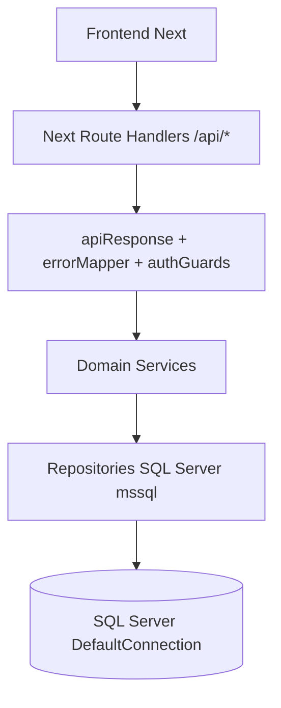

# Migración total backend a monolith-next

## Objetivo
Reemplazar `src/HouseholdFinance.Api` por rutas nativas en `monolith-next/src/app/api`, mantener SQL Server actual (`DefaultConnection`) y retirar toda dependencia de `LEGACY_API_BASE_URL` y del proxy a .NET.

## Estado actual verificado
- `monolith-next` hoy funciona como proxy en [`monolith-next/src/app/api/[...path]/route.ts`](G:/Proyectos_cursor/tablas/monolith-next/src/app/api/[...path]/route.ts).
- El proxy usa [`monolith-next/src/lib/http/proxyLegacy.ts`](G:/Proyectos_cursor/tablas/monolith-next/src/lib/http/proxyLegacy.ts) y [`monolith-next/src/lib/config/legacyApi.ts`](G:/Proyectos_cursor/tablas/monolith-next/src/lib/config/legacyApi.ts).
- SQL Server está preparado pero sin uso efectivo de negocio en [`monolith-next/src/lib/sql/sqlServer.ts`](G:/Proyectos_cursor/tablas/monolith-next/src/lib/sql/sqlServer.ts).
- Contrato a preservar: `ApiResponse<T>`, rutas `/api/auth`, `/api/households`, `/api/income-types`, etc. (hoy consumidas desde `src/frontend/api/*`).

## Arquitectura objetivo

## Plan de ejecución
1. **Fundación backend Node en monolith-next**
   - Crear capa HTTP común (`ApiResponse`, mapping de errores de negocio, correlación).
   - Definir errores tipados equivalentes a .NET: 400/401/403/404/409/500.
   - Consolidar configuración JWT/DB en `src/lib/config`.

2. **Autenticación y sesión JWT nativas**
   - Implementar `/api/auth/register`, `/api/auth/login`, `/api/auth/me`, `/api/auth/logout` en Next.
   - Implementar hash/verificación de contraseña y lockout equivalente funcional.
   - Añadir rate limit para login (paridad funcional con política actual).

3. **Autorización de hogar y guardas transversales**
   - Portar reglas de `RequireMembership`, `RequireOwner`, `RequireManageMembers`, `RequireManagePeriods`.
   - Crear middleware/utilidades reutilizables para validar acceso por `householdId` en rutas.

4. **Migración de módulos de dominio (rutas + servicios + repositorios SQL)**
   - Households + members.
   - Periods (crear, cerrar, reabrir).
   - Income-types + incomes.
   - Categories + recurring expenses.
   - Budget (incluyendo concurrencia/validaciones y generate-from-recurring).
   - Expenses (filtros, paginación, estados, validaciones).
   - Reports/dashboard (consultas agregadas).

5. **Compatibilidad de contrato con frontend existente**
   - Mantener exactamente rutas, shapes de DTO y envelope `ApiResponse<T>` esperados por `src/frontend/api/*`.
   - Verificar respuestas de error y códigos HTTP en casos de negocio.

6. **Cutover total (sin .NET)**
   - Eliminar catch-all proxy `[...path]` y `proxyLegacy`.
   - Remover `LEGACY_API_BASE_URL` de configuración y documentación.
   - Mantener `/api/health` con chequeo real de DB + JWT runtime.

7. **Validación final y checklist de despliegue Netlify**
   - Pruebas funcionales por módulo (login, hogar/periodo, ingresos, presupuesto, gastos, reportes).
   - Build/typecheck y smoke de endpoints críticos.
   - Actualizar README con variables finales y pasos de despliegue sin dependencia .NET.

## Archivos clave a intervenir
- API routes: [`monolith-next/src/app/api`](G:/Proyectos_cursor/tablas/monolith-next/src/app/api)
- Capa HTTP/auth: [`monolith-next/src/lib/http`](G:/Proyectos_cursor/tablas/monolith-next/src/lib/http), [`monolith-next/src/lib/config/env.ts`](G:/Proyectos_cursor/tablas/monolith-next/src/lib/config/env.ts)
- SQL layer: [`monolith-next/src/lib/sql/sqlServer.ts`](G:/Proyectos_cursor/tablas/monolith-next/src/lib/sql/sqlServer.ts)
- Cliente frontend a preservar: [`monolith-next/src/frontend/api`](G:/Proyectos_cursor/tablas/monolith-next/src/frontend/api)
- Elementos a retirar al corte: [`monolith-next/src/lib/http/proxyLegacy.ts`](G:/Proyectos_cursor/tablas/monolith-next/src/lib/http/proxyLegacy.ts), [`monolith-next/src/lib/config/legacyApi.ts`](G:/Proyectos_cursor/tablas/monolith-next/src/lib/config/legacyApi.ts), [`monolith-next/src/app/api/[...path]/route.ts`](G:/Proyectos_cursor/tablas/monolith-next/src/app/api/[...path]/route.ts)

## Riesgos a controlar
- Paridad exacta de reglas de negocio (periodos cerrados, ownership, conflictos 409).
- Compatibilidad JWT para no romper sesiones/guardas de frontend.
- Complejidad SQL en reportes y presupuesto (agregaciones y validaciones).
- Evitar regresiones al cortar el proxy en una sola fase (big bang).