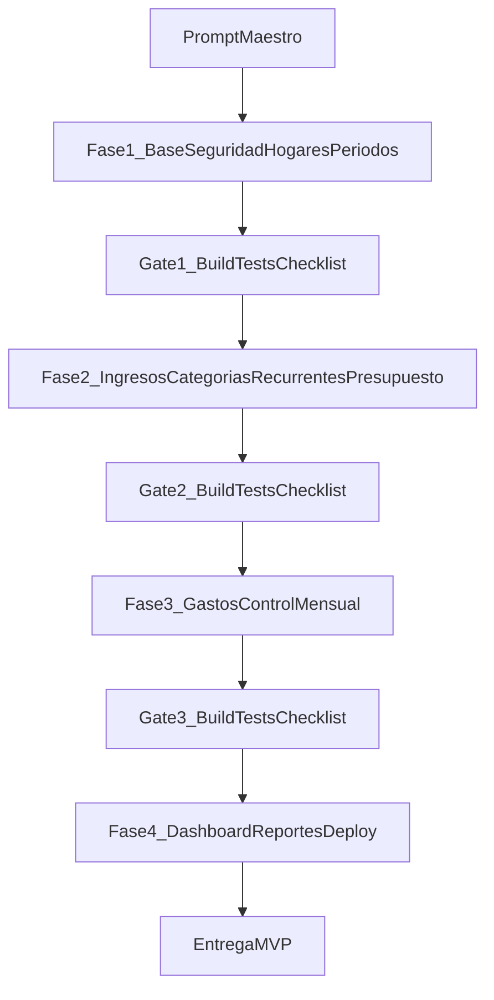

# Plan de implementación — Finanzas del Hogar (4 fases)

## Contexto base
- Fuente principal: [G:/Proyectos_cursor/tablas/intenciones/prompt-vibe-coding-app-finanzas-hogar-4-fases.md](G:/Proyectos_cursor/tablas/intenciones/prompt-vibe-coding-app-finanzas-hogar-4-fases.md).
- Estado actual: repositorio greenfield (sin backend/frontend aún).
- Restricción confirmada: la cadena de conexión SQL la proporcionarás tú al momento de implementación.
- Restricción operativa: todos los entregables de proceso se centralizan en [G:/Proyectos_cursor/tablas/Procesos](G:/Proyectos_cursor/tablas/Procesos).

## Estructura objetivo (alto nivel)
- Backend: `src/HouseholdFinance.Api` + `tests/HouseholdFinance.UnitTests` + `tests/HouseholdFinance.IntegrationTests`.
- Frontend: SPA React+TS (Vite) desacoplada de la API.
- Documentación técnica estable: `Documentation/`.
- Evidencias y checkpoints por fase: `Procesos/fase-1` a `Procesos/fase-4`.

## Flujo de trabajo por fase

## Fase 1 — Base técnica, seguridad, hogares y períodos
- Levantar solución .NET 8 API + pruebas + base React/TS.
- Configurar Identity + JWT + Swagger + middleware global + health check.
- Modelar `ApplicationUser`, `Household`, `HouseholdMember`, `FinancialPeriod`, `AuditLog` con migración inicial.
- Implementar auth, hogares, miembros y flujo de períodos (crear/consultar/cerrar/reabrir) con validación de pertenencia y auditoría.
- Entregables en [G:/Proyectos_cursor/tablas/Procesos/fase-1](G:/Proyectos_cursor/tablas/Procesos/fase-1): checkpoint, decisiones técnicas, validaciones ejecutadas, riesgos.

## Fase 2 — Ingresos, categorías, recurrentes y presupuesto
- Agregar entidades y reglas de `IncomeType`, `Income`, `ExpenseCategory`, `RecurringExpense`, `MonthlyBudget`, `BudgetLine`.
- Implementar cálculos autoritativos backend, idempotencia de generación y control de concurrencia.
- Construir pantallas de ingresos, categorías, gastos fijos y asistente de presupuesto con advertencias.
- Entregables en [G:/Proyectos_cursor/tablas/Procesos/fase-2](G:/Proyectos_cursor/tablas/Procesos/fase-2).

## Fase 3 — Gastos, pagos y control operativo mensual
- Implementar `Expense`, estados (pendiente/confirmado/anulado), filtros, paginación y prevención de doble envío.
- Alinear impacto en presupuesto/categorías y reglas de período cerrado.
- Construir registro rápido y vistas de movimientos con manejo de conflictos.
- Entregables en [G:/Proyectos_cursor/tablas/Procesos/fase-3](G:/Proyectos_cursor/tablas/Procesos/fase-3).

## Fase 4 — Dashboard, reportes, calidad y despliegue
- Implementar endpoints agregados de panel y reportes (budget-vs-actual, categoría, cash-flow, comparación mensual).
- Construir dashboard accesible/responsivo y exportación Excel.
- Cerrar hardening: rendimiento, seguridad, documentación final y guía de despliegue/rollback.
- Entregables en [G:/Proyectos_cursor/tablas/Procesos/fase-4](G:/Proyectos_cursor/tablas/Procesos/fase-4).

## Gestión de configuración (incluye SQL)
- Definir `.env.example` / `appsettings` sin secretos.
- Dejar `ConnectionStrings__DefaultConnection` parametrizado; se integra con el string SQL que nos compartirás.
- Validar configuración crítica al arranque y excluir secretos de repositorio/logs.

## Gates de calidad obligatorios por fase
- Backend: `dotnet restore`, `dotnet build`, `dotnet test`.
- Frontend: `npm run lint`, `npm run build`.
- Revisión de seguridad/autorización/periodo cerrado/auditoría.
- No avanzar de fase sin checkpoint completo en `Procesos` y criterios de aceptación cumplidos.

## Primer sprint sugerido (inicio inmediato)
- Ejecutar solo Fase 1 end-to-end.
- Al finalizar, emitir checkpoint en `Procesos/fase-1` con formato del prompt (análisis, decisiones, reglas, archivos, BD, API, frontend, seguridad, pruebas, ejecución, pendientes).