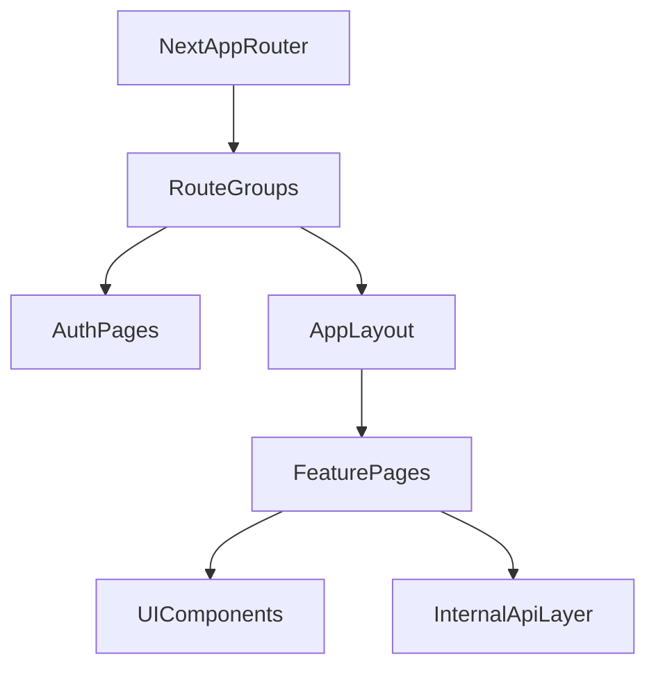

# Plan de frontend usuario final en Netlify

## Objetivo
Llevar `monolith-next` de la UI técnica de integración a una UI de usuario final con paridad funcional completa respecto a la SPA actual, manteniendo un único despliegue en Netlify.

## Base de migración (reuso)
- Rutas y estructura funcional actual en [G:/Proyectos_cursor/tablas/frontend/src/routes/AppRoutes.tsx](G:/Proyectos_cursor/tablas/frontend/src/routes/AppRoutes.tsx).
- Layout principal, navegación, selector de hogar/período y acción salir en [G:/Proyectos_cursor/tablas/frontend/src/layouts/MainLayout.tsx](G:/Proyectos_cursor/tablas/frontend/src/layouts/MainLayout.tsx).
- Estado actual de monolito (UI técnica) en:
  - [G:/Proyectos_cursor/tablas/monolith-next/src/app/page.tsx](G:/Proyectos_cursor/tablas/monolith-next/src/app/page.tsx)
  - [G:/Proyectos_cursor/tablas/monolith-next/src/components/MonolithClientApp.tsx](G:/Proyectos_cursor/tablas/monolith-next/src/components/MonolithClientApp.tsx)

## Arquitectura frontend objetivo

## Fase 1: Estructura de app y shell de navegación
- Crear estructura de rutas en `monolith-next/src/app/` con route groups:
  - `(auth)`: login/register
  - `(app)`: dashboard, periods, incomes, budget, expenses, recurring, categories, reports, members, settings
- Migrar `MainLayout` del frontend actual al layout de `(app)`.
- Implementar guardas de sesión y redirecciones equivalentes a `PrivateRoute`.
- Sustituir `MonolithClientApp` como pantalla principal de usuario por dashboard real.

## Fase 2: Capa compartida y contexto de aplicación
- Portar utilidades y tipos reutilizables desde `frontend/src/types`, `frontend/src/utils` y `frontend/src/context`.
- Definir proveedor global para:
  - usuario autenticado,
  - hogar activo,
  - período activo,
  - manejo de errores y estado de carga.
- Adaptar cliente HTTP para consumir APIs internas de Next (`/api/...`) en lugar de cliente externo.

## Fase 3: Migración de páginas por dominio (paridad completa)
- Migrar vistas y flujos con el mismo orden funcional de la SPA actual:
  1. Dashboard
  2. Periods
  3. Incomes
  4. Budget
  5. Expenses
  6. Recurring
  7. Categories
  8. Reports
  9. Members
  10. Settings
- Mantener estados UX existentes: loading, vacío, error, conflicto de autorización/cierre de período.
- Preservar navegación móvil y desktop en el layout.

## Fase 4: Hardening UX para Netlify
- Configurar fallback de rutas y comportamiento SPA/SSR en Netlify según App Router.
- Validar variables frontend necesarias (sin exponer secretos):
  - branding y banderas UI,
  - endpoints internos `/api`.
- Asegurar consistencia de sesión y logout en ambiente Netlify.

## Fase 5: Validación de paridad funcional
- Ejecutar checklist funcional comparativo entre `frontend/` y `monolith-next` por módulo.
- Validar flows críticos:
  - login/register/logout,
  - cambio de hogar/período,
  - creación/edición en ingresos, presupuesto y gastos,
  - reportes y filtros.
- Criterio de cierre: `monolith-next` cubre el menú funcional completo que hoy existe en la SPA anterior.

## Riesgos y mitigaciones
- **Riesgo:** diferencias de comportamiento entre React Router (SPA) y Next App Router.
  - **Mitigación:** migrar primero shell/rutas/guards y luego páginas por dominio.
- **Riesgo:** degradación de UX durante coexistencia UI técnica y UI final.
  - **Mitigación:** retirar `MonolithClientApp` del flujo principal al cerrar Fase 1.
- **Riesgo:** regresiones por portar contextos complejos.
  - **Mitigación:** pruebas de smoke por módulo y checklist de paridad por página.
